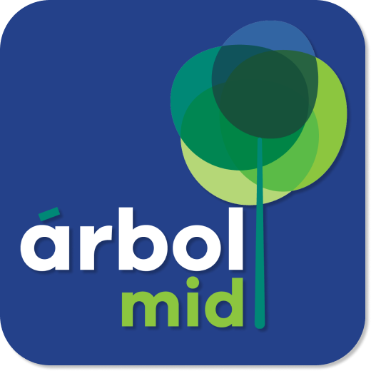
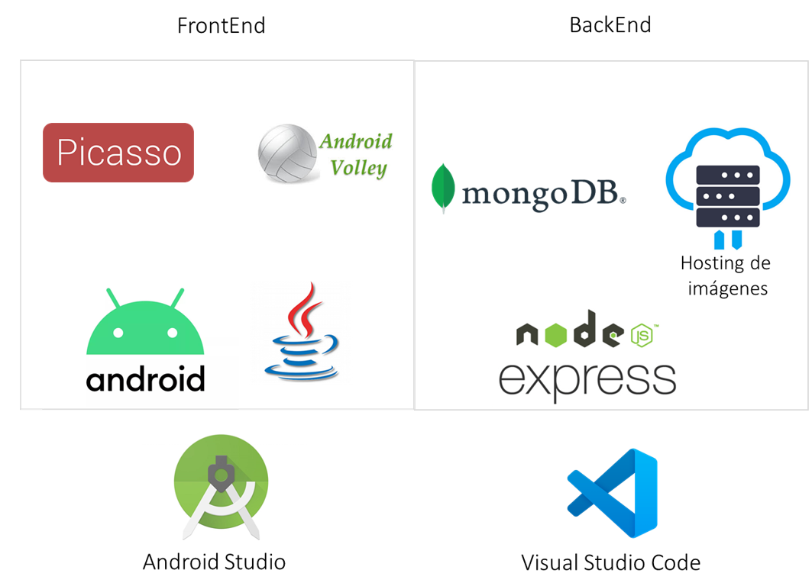
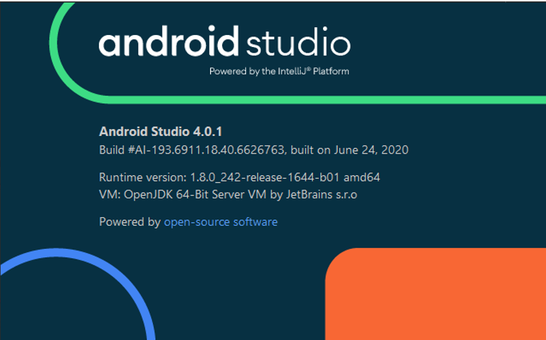

Arbolmid
====================================

Descripción
===========

Esta aplicación ofrece datos de arbolado en la ciudad de Mérida Yucatán así como información sobre diversas especies, su correcto cuidado y beneficios a la población								
En ella podrás navegar un mapa con más de 12,000 árboles localizados en los parques de la ciudad,
consultar información de 100 especies de árboles así como aprender a identificarlos mediante 
dinámicas de aprendizaje y una guía de arbolado, la cual te ayudará a analizarlos paso a paso 
ofreciéndote conocimientos importantes para su correcto cuidado. 
Si eres amante de los árboles, tienes interés en ellos o quieres sembrar un árbol en tu hogar 
pero no sabes cuál. ¡Esta aplicación es para ti aunque no vivas en la ciudad!

.. toctree::
   :maxdepth: 2
   :caption: Contents:

Arquitectura de la solución
###########################

En este apartado se detallan las tecnologias utilizadas en la solución tecnológica Arbolmid y su arquitectura.

FRONTEND
********

IDE Android Studio
******************
El FrontEnd fue desarrollado usando el lenguaje Java (Versión 1.8.0_161) para Android de forma nativa. El código fue escrito usando el IDE Android Studio versión 4.01 para Windows 10. (https://developer.android.com/studio). La aplicación fue desarrollada considerando una versión mínima de la API 21 para el Android SDK. 

Picasso
*******
Picasso es una librería para Android que permite descargar y visualizar imágenes de forma automática de internet a través de su dirección url. Esta biblioteca es usada para la descarga de las imágenes en la sección de “Catálogo de árboles” y la sección de “Aprende a Identificar” dentro de la aplicación Árbolmid. La versión de Picasso utilizada fue la 2.71828.

Android Volley
**************
Volley es una librería para Android que permite realizar peticiones http tales como GET y POST a servidores con el objetivo de recibir o enviar información en internet. Esta librería es utilizada para obtener información de las especies de árboles guardadas en la base de datos Mondodb y desplegar cada especie en la sección “Mapa de Arbolado” dentro de la aplicación móvil Árbolmid. La versio de volley utilizada fue la 1.1.1

BACKEND
*******

Node js
*******
Para el desarrollo del backend, se utilizó la tecnología provista por Node js. Node.js es un entorno en tiempo de ejecución multiplataforma, de código abierto, para la capa del servidor basado en el lenguaje de programación JavaScript. Este entorno de desarrollo cuenta con varias librerías y complementos para realizar la puesta en marcha de un servicio tipo API, conexiones para diferentes estructuras de bases de datos, tanto SQL como No SQL, con la ventaja de utilizar el lenguaje de programación Javascript. La versión utilizada para el entorno Node js fue la 10.13.0. 

MongodDB
********
MongoDB es un sistema de base de datos NoSQL de código abierto, desarrollado para el almacenamiento de documentos e información considerando una gran cantidad de datos. En lugar de guardar los datos en tablas, tal y como se hace en las bases de datos relacionales, MongoDB guarda estructuras de datos BSON (una especificación similar a JSON) con un esquema dinámico, haciendo que la integración de los datos en ciertas aplicaciones sea más fácil y rápida. Para la administración de forma gráfica de los documentos de MongoDB se utilizó la herramienta MongoDB Compass Community versión 1.2.1.2. 

Código de ejemplo.::

	>>print('Hola mundo')

Indices and tables
==================

* :ref:`genindex`
* :ref:`modindex`
* :ref:`search`
